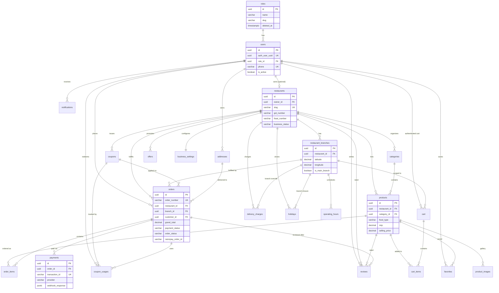

# GetNear Database Architecture

Production-ready PostgreSQL schema for a multi-restaurant food ordering platform (Swiggy/Zomato-style), designed for Supabase.

## Migration Files

All migrations live in `supabase/migrations/` and must be applied **in numeric order**:

| File | Table(s) |
|------|----------|
| `000_init_extensions_and_functions.sql` | Extensions, `set_updated_at()` trigger |
| `001_create_roles.sql` | `roles` |
| `002_create_users.sql` | `users` |
| `003_create_restaurants.sql` | `restaurants` |
| `004_create_restaurant_branches.sql` | `restaurant_branches` |
| `005_create_addresses.sql` | `addresses` |
| `006_create_categories.sql` | `categories` |
| `007_create_products.sql` | `products` |
| `008_create_product_images.sql` | `product_images` |
| `009_create_cart.sql` | `cart` |
| `010_create_cart_items.sql` | `cart_items` |
| `011_create_coupons.sql` | `coupons` |
| `012_create_offers.sql` | `offers` |
| `013_create_business_settings.sql` | `business_settings` |
| `014_create_delivery_charges.sql` | `delivery_charges` |
| `015_create_operating_hours.sql` | `operating_hours` |
| `016_create_holidays.sql` | `holidays` |
| `017_create_orders.sql` | `orders` |
| `018_create_order_items.sql` | `order_items` |
| `019_create_payments.sql` | `payments` |
| `020_create_coupon_usages.sql` | `coupon_usages` |
| `021_create_notifications.sql` | `notifications` |
| `022_create_reviews.sql` | `reviews` |
| `023_create_favorites.sql` | `favorites` |

## How to Apply Migrations

### Option A — Supabase CLI (recommended)

```bash
# Install CLI: https://supabase.com/docs/guides/cli
supabase login
supabase link --project-ref YOUR_PROJECT_REF
supabase db push
```

### Option B — Supabase SQL Editor

Run each file in order in the Supabase Dashboard → SQL Editor. Do **not** use the Table Editor.

### Option C — psql

```bash
psql "$DATABASE_URL" -f supabase/migrations/000_init_extensions_and_functions.sql
# ... repeat for 001 through 023
```

---

## ER Diagram (Mermaid)



---

## Table Relationships

### Identity & Access

| Relationship | Cardinality | Description |
|-------------|-------------|-------------|
| `roles` → `users` | 1:N | Every user has exactly one role (customer, admin, restaurant_owner, super_admin). |
| `users.auth_user_uuid` | 1:1 | Maps to Supabase `auth.users`. Application never queries `auth.users` directly. |
| `users` → `restaurants` | 1:0..1 | Restaurant owner link. NULL until admin assigns an owner. |

### Restaurant & Location

| Relationship | Cardinality | Description |
|-------------|-------------|-------------|
| `restaurants` → `restaurant_branches` | 1:N | Multi-branch support. Nearest branch selected via lat/lng. |
| `restaurant_branches` → `operating_hours` | 1:7 | One row per day of week per branch. |
| `restaurants` / `restaurant_branches` → `holidays` | 1:N | Restaurant-wide or branch-specific closures. |
| `restaurants` → `business_settings` | 1:1 | Tax rate, min order, payment modes per restaurant. |
| `restaurants` → `delivery_charges` | 1:N | Slab-based delivery fees; optional branch override. |

### Catalog

| Relationship | Cardinality | Description |
|-------------|-------------|-------------|
| `restaurants` → `categories` | 1:N | Menu sections scoped per restaurant. |
| `categories` → `products` | 1:N | Products belong to one category; RESTRICT on delete. |
| `products` → `product_images` | 1:N | Multiple images; one primary per product. |
| `restaurants` → `offers` | 1:N | Marketing banners and promotional campaigns. |
| `restaurants` → `coupons` | 1:N | Checkout coupon codes with usage limits. |

### Cart & Checkout

| Relationship | Cardinality | Description |
|-------------|-------------|-------------|
| `cart` → `restaurant_branches` | N:1 | Cart is branch-scoped for inventory and delivery. |
| `cart` → `users` OR `session_id` | N:0..1 | Guest carts use `session_id`; logged-in carts use `user_id`. |
| `cart` → `cart_items` | 1:N | Line items with quantity and price snapshot. |
| `cart_items` → `products` | N:1 | Product reference; CASCADE delete if product removed. |

### Orders & Payments

| Relationship | Cardinality | Description |
|-------------|-------------|-------------|
| `orders` → `restaurants` + `restaurant_branches` | N:1 | Order tied to restaurant and fulfilling branch. |
| `orders` → `users` | N:1 | Customer who placed the order (post OTP login). |
| `orders` → `addresses` | N:1 | Delivery address snapshot reference. |
| `orders` → `coupons` | N:0..1 | Optional applied coupon. |
| `orders` → `order_items` | 1:N | Immutable line items with product name/price snapshot. |
| `orders` → `payments` | 1:N | Razorpay transactions and webhook audit trail. |
| `coupons` → `coupon_usages` | 1:N | Tracks per-user redemption for limit enforcement. |

### Engagement

| Relationship | Cardinality | Description |
|-------------|-------------|-------------|
| `users` → `addresses` | 1:N | Saved delivery addresses. |
| `users` → `favorites` | 1:N | Saved products for quick reorder. |
| `users` → `reviews` | 1:N | Post-delivery ratings (restaurant and/or product level). |
| `users` → `notifications` | 1:N | Order status, payment, and promo alerts. |

---

## Design Decisions

1. **UUID primary keys** via `gen_random_uuid()` for distributed-safe IDs.
2. **Soft delete** (`deleted_at`) on master entities: roles, users, restaurants, branches, categories, products, coupons, offers, delivery_charges, holidays, orders, reviews.
3. **Price snapshots** in `cart_items` and `order_items` so historical orders remain accurate after menu price changes.
4. **Guest cart support** via `session_id` before phone OTP authentication.
5. **Multi-tenant ready** — every catalog, coupon, offer, and setting is scoped by `restaurant_id`.
6. **`updated_at` triggers** on all mutable tables via shared `set_updated_at()` function.
7. **JSONB extension points** in `business_settings.additional_settings` and `payments.webhook_response`.

---

## Future Scalability Considerations

| Area | Current Design | Future Extension |
|------|---------------|------------------|
| Multi-restaurant | `restaurant_id` on all tenant tables | Add RLS policies per restaurant; no schema change needed |
| Multi-branch delivery | Geo indexes on branches | Add PostGIS extension + `ST_DWithin` for radius queries |
| Menu variants | Single product row | Add `product_variants` table (size, addons) linked to `products` |
| Inventory | `products.is_available` flag | Add `inventory` table with branch-level stock counts |
| Delivery partners | Branch fulfills order | Add `delivery_assignments` + `delivery_partners` tables |
| Loyalty / wallet | Not in v1 | Add `wallets`, `wallet_transactions`; link to `payments` |
| Google OAuth | Phone OTP only | Same `users` table; map additional auth provider in profile |
| Analytics | Indexed order/payment columns | Materialized views or read replica for reporting |
| Search | B-tree indexes on name | Add `tsvector` full-text search or Elasticsearch sync |
| Rate limiting coupons | `coupon_usages` + `per_user_limit` | Add database function for atomic redemption |
| Order status history | Single `order_status` column | Add `order_status_history` audit table |
| Franchise model | Single owner per restaurant | Add `restaurant_staff` junction with role permissions |

---

## Indexes Summary

Searchable and filter columns indexed:

- User: `phone`, `email`, `role_id`
- Restaurant: `slug`, `name`, `business_status`
- Branch: `city`, `pincode`, `(latitude, longitude)`
- Product: `name`, `food_type`, `selling_price`, `is_available`, `is_featured`
- Order: `order_number`, `payment_status`, `order_status`, `placed_at`, Razorpay IDs
- Coupon: `code` (case-insensitive per restaurant), validity window

---

## Auth Integration Notes

1. Customer signs in via **Supabase Phone OTP** → creates row in `auth.users`.
2. On first login, app inserts into `users` with `role_id` = customer role and `auth_user_uuid`.
3. Admin/restaurant owner accounts are created by Super Admin — not self-registration.
4. Row Level Security (RLS) policies should be added in a future migration once frontend roles are wired.
